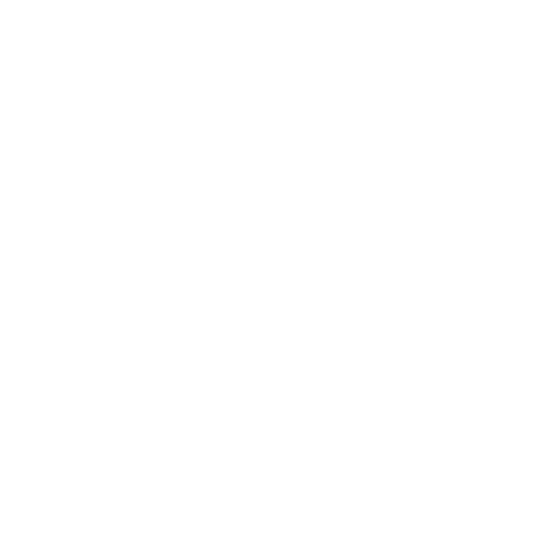

- 👋 Hi, I’m Aditya (@Temaroon)
- ✨ I’m interested in Coding, Gaming, Music & Movies
- 🌱 I’m currently learning `Web/Android Development`, `Python`, `C++`, `JavaScript`, `Java`, `DSA`, `Node.js`
- 📫 How to reach me | [Social Links](#connect-with-me)

## My Skill Set

<table>
<tr>
<td valign="top" width="33%">

<!--  -->

</td>

<td valign="top" width="33%">

  

</td>
</tr>
</table>

## Contributions

<picture>
  <source media="(prefers-color-scheme: dark)" srcset="https://raw.githubusercontent.com/aditya-2k23/aditya-2k23/output/github-snake-dark.svg" />
  <source media="(prefers-color-scheme: light)" srcset="https://raw.githubusercontent.com/aditya-2k23/aditya-2k23/output/github-snake.svg" />
  
</picture>

## Holopin Badges

## Connect with me

 

## 🏆 GitHub Trophies

## 📊 GitHub Stats:

<table>
  <tr>
  <td>
    
     
  </td>  
  <td>
    

  </td>
  </tr>
</table>

 

<table>
  <tr>
    <td>
      
## DevCard

    </td>
    <td valign="top">
    

    
## 💰 You can help me by Donating

 

[comment]: <> (## Add latest projects section)
    

    </td>
  </tr>
</table>

